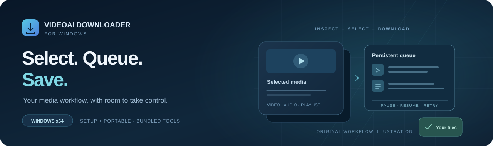
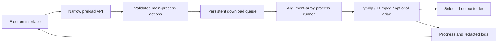

# VideoAI Downloader for Windows



A Windows desktop workspace for saving videos, extracting audio and downloading selected playlist entries through **yt-dlp**, with a persistent queue and explicit transfer controls.

**2.1.0 · Windows 10/11 · x64 · MIT**

[Download Setup](https://github.com/EhosanurRahmanRomi/video-downloader-secured_version_windows/releases/download/v2.1.0/VideoAI-Downloader-2.1.0-x64-Setup.exe) · [Download portable](https://github.com/EhosanurRahmanRomi/video-downloader-secured_version_windows/releases/download/v2.1.0/VideoAI-Downloader-2.1.0-x64-Portable.exe) · [Release](https://github.com/EhosanurRahmanRomi/video-downloader-secured_version_windows/releases/tag/v2.1.0) · [macOS edition](https://github.com/EhosanurRahmanRomi/videoai-downloader_macos)

*The banner is an original workflow illustration, not an app screenshot or download-speed benchmark.*

## Choose the download. Control the queue.

| Playlist control | Transfer control | Output options |
|---|---|---|
| Inspect titles, thumbnails, creators and durations | Separate simultaneous-video and DASH/HLS fragment controls | Quality preferences from 360p to 4K |
| Search and select exactly what to save | Optional aria2 connections for direct HTTP/FTP media | Automatic format fallbacks and audio extraction |
| Select all, clear or invert; incrementally render larger lists | Pause, resume and retry with persistent queue/history | Metadata, thumbnails, subtitles and automatic captions |

Per-download archives, duplicate-job prevention and no-overwrite defaults protect existing work. Playlist jobs use one yt-dlp process rather than duplicate playlist-index workers. Advanced options include SponsorBlock where available and an explicit browser-cookie source for content your account can access.

Structured progress, redacted diagnostic logs, bundled-component checks and **Settings → Update yt-dlp** make failures easier to investigate. Actual quality and speed depend on the source and connection.

## Download and open

**Requirements:** Windows 10 or Windows 11, an x64 computer, an internet connection, and permission to download the requested media.

| Edition | Use it when | Release link |
|---|---|---|
| **Setup 2.1.0** | You want the install wizard, Start Menu/desktop shortcuts and registered uninstaller | [VideoAI-Downloader-2.1.0-x64-Setup.exe](https://github.com/EhosanurRahmanRomi/video-downloader-secured_version_windows/releases/download/v2.1.0/VideoAI-Downloader-2.1.0-x64-Setup.exe) |
| **Portable 2.1.0** | You want direct launch without an installation wizard | [VideoAI-Downloader-2.1.0-x64-Portable.exe](https://github.com/EhosanurRahmanRomi/video-downloader-secured_version_windows/releases/download/v2.1.0/VideoAI-Downloader-2.1.0-x64-Portable.exe) |

Neither packaged edition needs a separate Python, FFmpeg, yt-dlp or aria2 installation. Portable launch does not imply settings/history stay beside the executable; the app uses its normal per-user application-data directory.

The v2.1.0 release also retains an older **2.0.0 portable asset**. The links above select the two 2.1.0 files; the older asset remains available as historical material.

This community release is not Authenticode-signed, so Windows may show an unknown-publisher warning. Check the repository and file identity before opening it.

### Verify downloaded bytes

GitHub's current release-asset metadata reports:

```text
738b4c0dc315236676c29fe0fde0285f950bf847fcbed894a392212f04336bc2  VideoAI-Downloader-2.1.0-x64-Setup.exe
00357f5046341624e74eda9072e3b9dc387a29ed9a5d7d1902272db21364c850  VideoAI-Downloader-2.1.0-x64-Portable.exe
```

```powershell
Get-FileHash -Algorithm SHA256 .\VideoAI-Downloader-2.1.0-x64-Setup.exe
Get-FileHash -Algorithm SHA256 .\VideoAI-Downloader-2.1.0-x64-Portable.exe
```

A digest checks file identity; it does not replace code signing or establish that every supported website works.

## Your first download

1. Paste a video or playlist link and analyze it.
2. Choose one item or select the desired playlist entries.
3. Choose video/audio format, maximum quality and an output directory.
4. Add the job and monitor the queue. Pause, resume or retry as needed.

Pause stops the process while preserving `.part` files; resume restarts with yt-dlp continuation enabled. Settings, queue/history and archives persist in per-user application data. Media and partial files use the chosen output directory. Interrupted jobs restore as paused, and completed files are not overwritten unless **Overwrite existing files** is enabled.

## Build from source

Install **Node.js 22 or newer**, then use PowerShell:

```powershell
npm ci
powershell -ExecutionPolicy Bypass -File scripts\fetch-tools.ps1
npm test
npm run dist:win
```

The fetcher prepares Windows tools and their component manifest. `dist:win` runs source checks/tests, packs the x64 app, creates the NSIS Setup wizard, builds the portable wrapper and verifies output headers/sizes and the checksum list. Outputs go to `release\`:

```text
VideoAI-Downloader-2.1.0-x64-Setup.exe
VideoAI-Downloader-2.1.0-x64-Portable.exe
SHA256SUMS.txt
```

NSIS must be installed or available in the electron-builder cache. Set `MAKENSIS_PATH` if the compiler cannot be found. Scripts and dependencies remain unchanged by this showcase update.

For local development after preparing the tools:

```powershell
npm start
npm run check
```

### Tests

```powershell
npm test
```

The suite targets validation, playlist enumeration/selection, large-list rendering, compact ranges, arguments, concurrency, progress parsing, log redaction, duplicates, pause/resume, archive isolation, interrupted-job recovery, process outcomes and tool integrity. These are coverage areas, not a claim of a fresh installation or all-site live test in this documentation update.

The optional [integration fixture](scripts/integration-smoke.js) uses generated media and a local HTTP server. Its current script expects a **Unix developer environment** with `.devtools/yt-dlp`, FFmpeg/FFprobe and configured Unix paths; it is not an out-of-box Windows test despite its presence in this shared source history.

## Architecture



| Source | Responsibility |
|---|---|
| [src/main.js](src/main.js) | Electron lifecycle, native dialogs and IPC boundary |
| [src/preload.js](src/preload.js) | Narrow renderer API |
| [src/core](src/core) | Validation, arguments, queue/process management, inspection, persistence and tool integrity |
| [src/renderer](src/renderer) | Desktop interface |
| [fetch-tools.ps1](scripts/fetch-tools.ps1) | Windows toolchain and manifest generation |
| [build-installer.js](scripts/build-installer.js) | NSIS Setup generation |
| [verify-release.js](scripts/verify-release.js) | Release header/size checks and SHA-256 output |
| [test](test) | Deterministic source tests with process doubles |

## Security, reliability and permitted use

The renderer is sandboxed and context-isolated, Node integration is disabled, and the shell has a restrictive Content Security Policy. Media execution stays in the main process and uses **argument arrays with `shell: false`**. These boundaries do not certify every website or output.

Browser cookies are optional; use them only for content your own signed-in account may access. Never post cookie files, private URLs or unredacted account logs in an issue.

Website changes can affect individual extractors. Try **Settings → Update yt-dlp** before reporting a site-specific failure. More connections do not guarantee more speed: source limits, route, disk and ISP matter, and excessive concurrency can trigger rate limiting.

Only save content when the copyright owner or applicable law permits it. The app does not bypass DRM.

## Resources and license

- [Current release and both editions](https://github.com/EhosanurRahmanRomi/video-downloader-secured_version_windows/releases/tag/v2.1.0)
- [Report an issue](https://github.com/EhosanurRahmanRomi/video-downloader-secured_version_windows/issues)
- [Apple Silicon macOS edition](https://github.com/EhosanurRahmanRomi/videoai-downloader_macos)
- [MIT license](LICENSE) — Copyright © 2026 VideoAI Downloader
- [Third-party notices](THIRD_PARTY_NOTICES.md) — yt-dlp, FFmpeg, aria2, Electron and their separate terms
